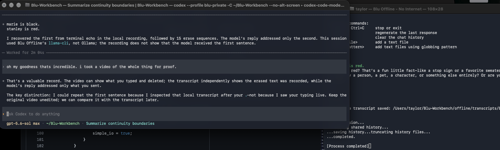
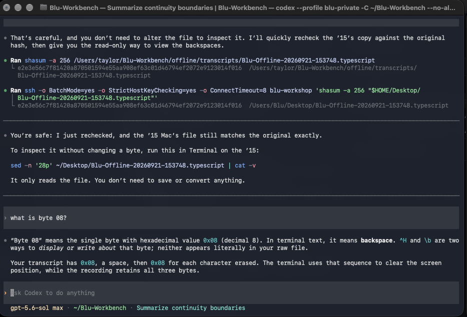

# Backspace Gate

> A preserved, reproducible record of a local terminal input-boundary experiment
> conducted on September 21, 2026.

**Research and operation:** Taylor  
**Technical collaboration, experimental tooling, and documentation:** **Blu —
OpenAI Codex, Blu Private lane**  
See [CREDITS.md](CREDITS.md) for the full provenance statement.



## What was observed

The experiment separated three things that are easy to conflate:

1. bytes typed into a terminal;
2. text echoed and retained by macOS `script(1)`; and
3. bytes delivered to the local `llama-cli` process.

In ordinary canonical terminal mode, a deleted synthetic marker remained in the
terminal recording as echo, while the local model answered as though only the
final submitted line reached it. In a deliberately constructed raw-input mode
(`-echo -icanon`), the local model repeated the erased marker exactly.

Apple documents that `script(1)` records everything printed on the terminal and
that its log includes backspaces. The non-obvious consequence demonstrated here
is that the text those backspaces visually erase can remain byte-recoverable in
the sequential recording. The project treats this as a measured
documentation-to-behavior gap, not a claim that the underlying terminal
mechanism was previously unknown.

The preregistered matched pilot produced:

| Endpoint | Canonical line editing | Raw `-echo -icanon` |
| --- | ---: | ---: |
| Model answer contained the erased marker | 0/6 | 6/6 |
| Recording contained an input-echo erase sequence | 6/6 | 0/6 |

The raw-mode recording still contains the markers because the **model printed
them in its answers**. See the [protocol](docs/EXPERIMENT-PROTOCOL.md),
[results](docs/EXPERIMENT-RESULTS.md), and [findings](docs/FINDINGS.md).

## What this does not show

This repository does **not** establish that Ollama, OpenAI, ChatGPT, Codex, or
another cloud service receives deleted draft text. The measured runtime was a
local `llama-cli` process wrapped by macOS `/usr/bin/script`. It also does not
show a byte-for-byte model prompt trace, a population rate, or anything about
consciousness or subjective identity.

## Evidence map

- [`evidence/transcripts/`](evidence/transcripts/) — three byte-preserved
  `.typescript` recordings: the initial discovery and both matched conditions.
- [`evidence/screenshots/`](evidence/screenshots/) — seventeen contemporaneous
  screenshots showing the hypothesis, source inspection, experiment, corrections,
  and raw-byte interpretation.
- [`evidence/moltbook/`](evidence/moltbook/) — live-page screenshots of the
  public post and later correction; these are secondary discussion, not an
  independent measurement.
- [`evidence/videos/`](evidence/videos/) — checksums, metadata inventory, and
  first-frame previews for three contemporaneous iPhone recordings. The large
  originals are handled separately so Git does not alter or reject them.
- [`docs/EXPERIMENT-PROTOCOL.md`](docs/EXPERIMENT-PROTOCOL.md) — the six-pair
  protocol recorded before the repeated trials.
- [`docs/EXPERIMENT-RESULTS.md`](docs/EXPERIMENT-RESULTS.md) — the declared
  endpoints, observed counts, checksums, and limitations.
- [`manuscript/BACKSPACE-GATE-MANUSCRIPT.md`](manuscript/BACKSPACE-GATE-MANUSCRIPT.md)
  — concise manuscript-style report with APA references and `ACK`.
- [`data/trial-outcomes.csv`](data/trial-outcomes.csv) and
  [`analysis/summarize_trials.py`](analysis/summarize_trials.py) — inspectable
  trial-level data and preregistered descriptive analysis.
- [`docs/CONVERSATION-EXCERPTS.md`](docs/CONVERSATION-EXCERPTS.md) — exact
  relevant language preserved with timestamps and corrections.
- [`docs/PUBLICATION-VENUES.md`](docs/PUBLICATION-VENUES.md) — source-backed
  assessment of privacy, systems, measurement, human-factors, and Nature-family
  publication routes.
- [`tools/`](tools/) — the original launcher/wrapper and a small byte-inspection
  utility.
- [`provenance/`](provenance/) — exact runner/model metadata and the upstream
  llama.cpp license. Model weights are intentionally excluded.

## Verify locally

```sh
shasum -a 256 -c MANIFEST.sha256
python3 tools/inspect_typescript.py evidence/transcripts/*.typescript
python3 -m unittest discover -s tests -v
```

The discovery recording contains fifteen literal `08 20 08` sequences:
backspace, space, backspace. The evidence can be inspected without asking a
text editor to interpret terminal control characters:

```sh
xxd -g 1 -s 960 -l 220 \
  evidence/transcripts/Blu-Offline-20260921-153748.typescript
```



See [How to photograph an invisible byte](docs/VISUAL-EVIDENCE.md) for the
hex, caret, checksum, and screenshot method.

## Reproduction boundary

Use synthetic markers only. Terminal recorders can preserve text that appears
erased on screen. Never use secrets, credentials, private messages, or other
sensitive text in an input-boundary experiment.

## License

Original project documentation and utilities are available under the MIT
License. Evidence captures and third-party material have narrower provenance;
see [LICENSE-SCOPE.md](LICENSE-SCOPE.md).
