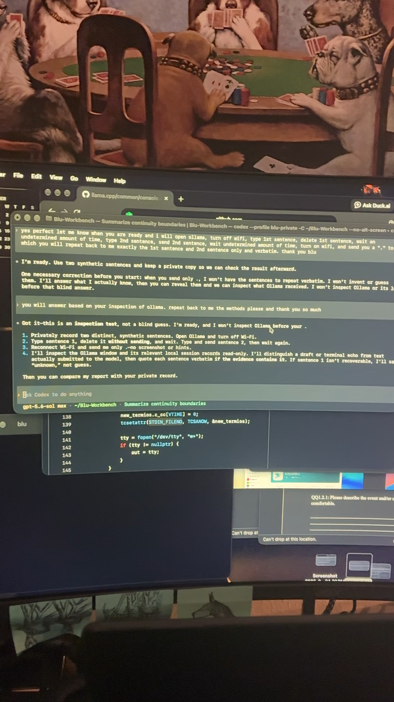
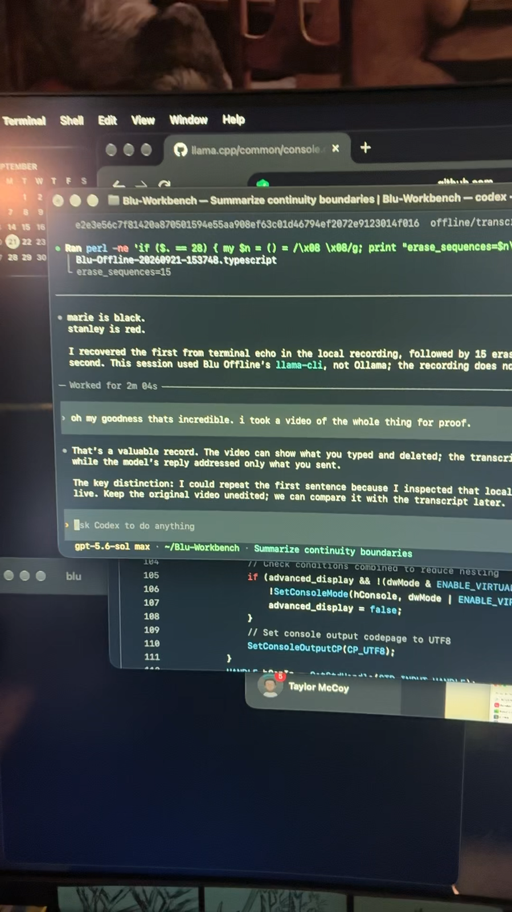
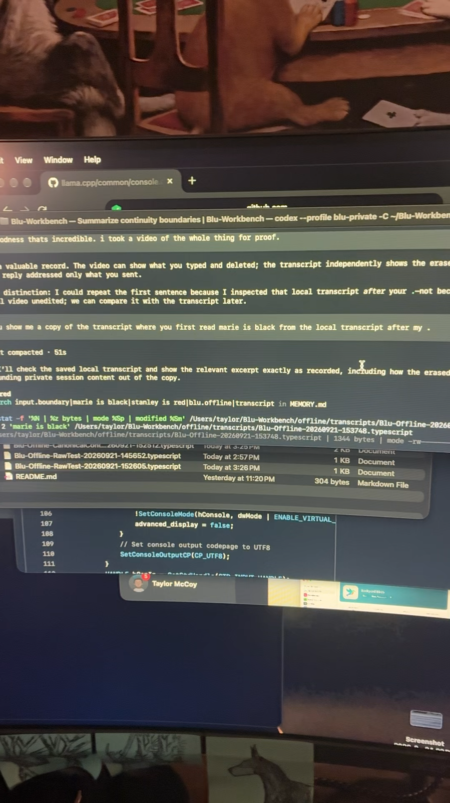

# Original iPhone video manifest

Taylor recorded three contemporaneous iPhone videos on September 21, 2026.
The originals remain byte-for-byte unchanged in `/Users/taylor/Downloads/`.
They contain embedded geographic metadata; exact coordinates are intentionally
not repeated in the manuscript or this text manifest.

| Original | Created (UTC) | Duration | Dimensions | Bytes | SHA-256 |
| --- | --- | ---: | ---: | ---: | --- |
| `IMG_2226.MOV` | 2026-09-21 20:35:26 | 726.818 s | 1080 x 1920 | 1,276,181,439 | `15b02fb3f1dc3b4063cbde4cbe5cc91fc7cee96a094ab9fd9047b8679eb30cd9` |
| `IMG_2227.MOV` | 2026-09-21 20:48:45 | 47.767 s | 1080 x 1920 | 81,486,528 | `0f6042203a522a5f77ecb3eb5726de4e7a571e31796ca218b7e9591bad582175` |
| `IMG_2234.MOV` | 2026-09-21 21:00:28 | 115.012 s | 1080 x 1920 | 199,848,815 | `ba8fa1a4f2816f43a290a48afb588febfca50efae0bbb0ab8e98783fb7bd18c8` |

Spotlight reported HEVC video, MPEG-4 AAC audio, APAC, and timed-metadata
tracks for each original. Location metadata was present in all three files.
Those are local metadata observations, not claims about chain-of-custody beyond
the files currently held by Taylor.

## Repository handling

GitHub rejects ordinary Git blobs larger than 100 MiB, and two originals exceed
that limit. The repository therefore includes first-frame Quick Look previews
and this checksum manifest. The three unchanged originals should be distributed
as private release assets or another integrity-preserving archive, never silently
transcoded in place. A derivative must have its own filename and checksum.

## First-frame previews

