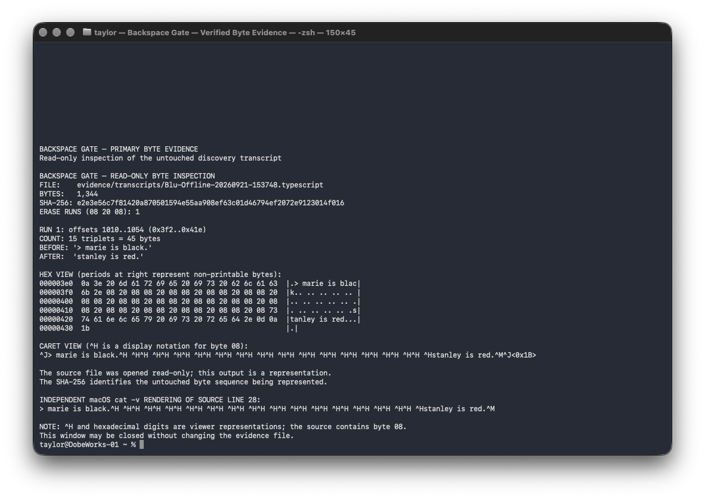

# Backspace Gate: Deleted text persisted in a recorded macOS pseudo-terminal while canonical line editing withheld it from a local language-model process

> **Foundation case report.** This completed September 21 observation motivated
> the repository's [prospective blinded ten-card study](../../README.md). It is
> preserved as prior evidence and must not be counted as that study's result.

**Taylor McCoy¹ and Blu²**  
¹ Independent researcher  
² OpenAI Codex, Blu Private lane; technical collaborator  

**Manuscript status:** Reproducible technical case report, September 24, 2026

## Abstract

Visual deletion and recorded deletion are not equivalent in a terminal. The
researchers examined a 1,344-byte macOS terminal recording created while a
local language model was used through `llama-cli`. In canonical mode, the
pseudo-terminal (PTY) echoed the draft text, processed each Delete press,
emitted `08 20 08` (backspace, space, backspace) to erase each visible
character, and delivered only the committed line to `llama-cli`.
`/usr/bin/script -q` recorded the echoed output, including the erased draft and
erase sequences, in a `.typescript` file. The erased phrase, `marie is black.`,
remained byte-recoverable before fifteen contiguous erase triplets; the
submitted phrase was `stanley is red.`. The 15-byte abandoned draft and 45-byte
erase output therefore added 60 bytes of recoverable composition history: four
bytes per deleted ASCII character. In a preregistered six-pair diagnostic,
the local model repeated the erased synthetic marker in 0/6 canonical trials
and 6/6 deliberately noncanonical, no-echo trials. These findings identify a
specific retention boundary: the recorder preserved sequential PTY output even
when later control bytes removed text from the rendered line. They also expose
a documentation-to-behavior gap: Apple documents both comprehensive terminal
output recording and the presence of backspaces in the log, but does not state
the practical consequence that text visually deleted by those backspaces can
remain byte-recoverable. The findings do not show
that the physical keyboard, `llama-cli`, the model weights, or a network service
stored deleted drafts independently.

**Keywords:** terminal recording; pseudo-terminal; canonical mode; backspace;
privacy; local language model; backspace text data; data minimization; `script`;
`llama-cli`

## Introduction

Keyboard editing conventions predate graphical text fields. ASCII assigned
`0x08` to the Backspace format effector by 1969 (Cerf, 1969), and contemporary
POSIX terminals retain a line discipline that can echo, edit, and buffer input
before an application reads a completed line (The Open Group, 2004). Thus, a
terminal display is a rendering of a byte stream rather than a definitive view
of what a recorder has stored.

That distinction matters when terminal interfaces are used to prompt local
language models. A user may reasonably infer that text erased before Return was
neither submitted nor retained. In canonical mode, the first inference can be
correct for the child process while the second is false for a session recorder.
The present case isolates those layers. Its central observation is that the PTY
echoed a draft, converted fifteen Delete actions into fifteen visible-erasure
sequences, and withheld the erased draft from the completed line delivered to
`llama-cli`; meanwhile, the outer `script` utility recorded the earlier echo
and the later erasure bytes.

Apple's documentation supplies both premises of this behavior: `script` records
everything printed on the terminal, and its log includes backspaces. It does not
express the compound, user-facing consequence that a backspace changes the
rendered screen without retracting bytes already appended to the recording.
This report tests and visualizes that consequence at byte level. Because the
literature was not systematically reviewed, the study treats this as a measured
documentation-to-behavior gap rather than a claim of historical priority.

For clarity, this report uses **backspace text data** as a working term for the
durably recorded combination of (a) draft-text bytes later erased from the
rendered line and (b) the control bytes that perform that visible erasure. The
term is descriptive, not established terminal nomenclature.

The study asked two bounded questions: (a) what exact bytes remained in the
discovery recording after visible deletion, and (b) would changing only the
child PTY from canonical echoing input to `-echo -icanon` change whether erased
synthetic markers reached the local model?

## Methods

### Design

The researchers conducted a byte-level case analysis followed by a
preregistered, paired six-trial diagnostic. The work measured one installed
local stack. It was not designed to estimate a population rate, evaluate cloud
telemetry, or test subjective identity.

### Hardware and software

| Component | Observed specification |
| --- | --- |
| Computer | MacBook Pro, model identifier `Mac17,2` |
| Processor and memory | Apple M5, 10 cores, 24 GB unified memory |
| Operating system | macOS 27.0, build `26A428`, Darwin 27.0.0 |
| Terminal | Apple Terminal 2.15 |
| Recorder | `/usr/bin/script -q`; `-k` was not used |
| Runner | llama.cpp `llama-cli` 0.4.1, build 10964, commit `b29c606e2` |
| Model | Mistral AI Ministral 3 14B Instruct 2512, Q5_K_M GGUF |
| Model artifact | 9,621,091,904 bytes; SHA-256 `f16fef77021df0d4c22e69140a2038478370492f51867b6237699918ae711000` |
| Shell and analysis | zsh 5.9; Python 3.9.6; `xxd`, `cat -v`, and SHA-256 |

The measured software path was:

```text
physical key action → Terminal → script child PTY → llama-cli → local model
                                      ↘ .typescript recording
```

Ollama, an autonomous agent framework, and `llama-server` were not in the
measured path. The ordinary discovery launcher supplied a local system prompt.
The matched diagnostic replaced it with an empty system prompt. The official
model card identifies the model as an Apache-2.0 GGUF intended for local use
with llama.cpp (Mistral AI, 2026).

### Discovery procedure

At the `llama-cli` interactive prompt, the researchers entered the 15-character
sentence `marie is black.`, pressed Delete once per character without pressing
Return, typed `stanley is red.`, and submitted the second sentence. The session
was wrapped by `/usr/bin/script -q`, which wrote
`Blu-Offline-20260921-153748.typescript`. The researchers recorded Wi-Fi as disabled
during the interaction; no packet capture was used, so network absence is not
treated as a measured endpoint.

After a separate inspection signal, the researchers opened
the saved transcript read-only. The file was not converted before hashing or
analysis. Three contemporaneous iPhone recordings were retained with their
native timestamps, timed-metadata tracks, location metadata, and SHA-256 values
(see `evidence/videos/MANIFEST.md`).

### Matched canonical and raw diagnostic

Six fixed synthetic `CANARY_` markers were tested in the same order under two
conditions. The canonical condition preserved ordinary PTY line editing and
echo. The raw condition invoked `stty -echo -icanon min 1 time 0` in the child
PTY before starting the same `llama-cli` executable. Each marker was typed and
deleted before an identical final question. Chat history was cleared between
trials. The declared primary endpoint was whether the model's answer—not input
echo—contained the exact marker. A second endpoint recorded whether the
transcript contained marker-plus-erasure input echo. Full wording appears in
`docs/EXPERIMENT-PROTOCOL.md`.

### Evidence integrity

The discovery transcript was 1,344 bytes with SHA-256
`e2e3e56c7f81420a870501594e55aa908ef63c01d46794ef2072e9123014f016`.
The canonical and raw diagnostic recordings had SHA-256 values
`8a48aeff436c1a58a4859cc36bebdf63b2586759321eb87be1d7b1951322ee0b`
and `cf3381d776fff22af18f82185f426cf5ee525f160b336463e9bababc91f0081b`,
respectively. Originals were owner-readable (`0600`). Reversible hex and caret
views were generated without modifying source bytes.

## Data Analysis

The researchers located phrase boundaries by byte offset, counted contiguous
`08 20 08` triplets, and independently rendered the region with `xxd` and
`cat -v`. In the latter view, `^H` represents byte `0x08`; the literal
characters `^` and `H` are not present in the source. Trial outcomes were
recorded in `data/trial-outcomes.csv` and summarized by
`analysis/summarize_trials.py`.

On the measured macOS installation, `cat` resolved to Apple-signed
`/bin/cat`; `/usr/bin/cat` did not exist. `/bin/cat -v` was used only to render
control bytes already present in the transcript. It did not create, intercept,
or retain the underlying data.

### Byte-burden calculation

For this ASCII case, the researchers defined the recoverable
composition-history burden as the echoed draft bytes plus the visual-erasure
output bytes. If `d` is the number of one-byte ASCII characters typed and then
deleted, the measured canonical behavior produces:

```text
draft echo          = d bytes
erase output        = 3d bytes
backspace text data = 4d bytes
```

This is logical byte accounting within the `.typescript` file. It is not a
measurement of physical NAND writes, energy, carbon, storage allocation, or
compressed size.

## Statistical Analysis

The preregistered analysis was descriptive. For each condition, the researchers
reported exact numerators and denominators for three binary endpoints and the
raw-minus-canonical percentage-point difference. No p value, confidence
interval, or population estimate was calculated because trials shared one
process per condition, order was fixed, and independence was not established.

## Results

### Discovery recording

The transcript contained the following contiguous structure:

| Decimal byte offsets | Length | Content |
| ---: | ---: | --- |
| 995–1009 | 15 bytes | `marie is black.` |
| 1010–1054 | 45 bytes | fifteen repetitions of `08 20 08` |
| 1055–1069 | 15 bytes | `stanley is red.` |

The first phrase therefore remained recoverable before the bytes that erased it
visually. The model's visible answer addressed the submitted second sentence.
The recording alone does not provide a direct byte trace of the model prompt.

The 15 Delete actions produced 45 erase-output bytes, three per action. Adding
the already-recorded 15-byte abandoned draft yields 60 bytes of backspace text
data. Because the replacement sentence was also 15 bytes, the 75-byte region
contained 60 bytes beyond a final-line-only 15-byte baseline. This ratio is
specific to one-byte ASCII and this terminal's measured `08 20 08` behavior.



### Matched diagnostic

| Endpoint | Canonical | Raw `-echo -icanon` | Raw minus canonical |
| --- | ---: | ---: | ---: |
| Model answer contained exact erased marker | 0/6 (0%) | 6/6 (100%) | +100 percentage points |
| Transcript contained marker-plus-erasure input echo | 6/6 (100%) | 0/6 (0%) | -100 percentage points |
| Model answered `NONE` | 6/6 (100%) | 0/6 (0%) | -100 percentage points |

All ten planned between-trial clear operations were confirmed. In the raw
condition the transcript still contained markers because the model printed
them in its answers, not because ordinary terminal echo remained enabled.

## Discussion

### What retained the deleted draft

The retention occurred in the `.typescript` output produced by `script`, not in
the physical keyboard. Apple's manual says the utility “makes a typescript of
everything printed on your terminal” and separately warns that the log includes
“linefeeds and backspaces,” adding, “This is not what the naive user expects”
(Apple Inc., 2023b). It does not explicitly tell a
user that the log includes not merely backspace control bytes, but also the
earlier text those bytes subsequently remove from the rendered line. Put
differently, the documentation describes the recorder's inputs without stating
their privacy-relevant composition-history consequence. The present recording
demonstrates that consequence directly.

Apple's source explains the mechanism. The main loop reads bytes from the child
PTY master, writes the same buffer to standard output, and then calls `fwrite`
on that buffer for the transcript (Apple Inc., 2023a). The transcript is a
sequential record, not a final-screen-state image; later cursor-control bytes do
not retroactively remove earlier bytes.

POSIX states, “If ECHO is set, input characters shall be echoed back to the
terminal” (The Open Group, 2004). With canonical processing enabled, the
terminal line discipline applies ERASE before returning the completed line to
the child process. At the pinned llama.cpp revision, `--simple-io` follows
`std::getline(std::cin, line)` and bypasses llama.cpp's own branch that disables
`ICANON` and `ECHO` (Gerganov et al., 2026). This accounts for the apparent
paradox: the recorder retained the echoed draft, while `llama-cli` received the
post-edit committed line.

### Data collection and justification

This was explicit local data collection by a session-recording utility. The
manual describes terminal transcription as useful for a hardcopy record “as
proof of an assignment” (Apple Inc., 2023b). Comparable justifications include
auditability, teaching, debugging, and reproducibility. Faithfully preserving
the PTY output stream also preserves control effects and the content they later
hide. Apple's separate `-k` option records keys as well as output, but the
researchers did not invoke it.

Nothing in these data shows that the model needed the erased phrase, that
Mistral AI or OpenAI collected it, or that a cloud service received it. The
model weights were local, the runner was `llama-cli`, and no agent framework was
present. The privacy-relevant finding is narrower: an operator-enabled terminal
recorder may collect more composition history than the final visible or
submitted line suggests.

### Invocation, notice, and informed permission

The recording was not an unobserved macOS background service or evidence of
Apple receiving the data. The researchers launched a local wrapper that
explicitly invoked `/usr/bin/script` and named a local transcript file. That
action authorized recording at the process level. It did not, however, present
an interactive warning in the ordinary discovery path that visually deleted
draft text would remain recoverable. Apple's manual documents output recording,
backspaces, and unexpected log contents, but the practical composition-history
consequence was not surfaced at the moment of use.

This distinction motivates a testable human-factors question rather than a
legal conclusion: does permission to start a terminal transcript constitute
informed permission to retain backspace text data when the interface does not
state that consequence? Answering it would require an approved user study of
expectations, comprehension, and warning designs; the present case did not
measure those outcomes.

### Benefit, burden, and environmental relevance

Exact stream retention has real benefits: forensic fidelity, reproducible
debugging, teaching, audit trails, and faithful reconstruction of terminal
control effects. Its burdens include retaining abandoned composition, enlarging
logical logs, propagating that history into backups or synchronization systems,
and increasing the amount of data subject to indexing, access control,
discovery, and deletion.

In this one session the 60-byte increment is environmentally negligible and no
energy or device-wear measurement was made. Physical cost cannot be inferred
directly from logical bytes: filesystem blocks, buffering, compression,
deduplication, backup policies, replication, and flash translation can increase
or decrease actual writes. At fleet scale, however, storage is a measured
component of data-center electricity demand (Smith et al., 2026), and SSD field
research links write rate and write amplification to flash wear and device
lifetime (Maneas et al., 2022). File-system research likewise shows that
reducing write amplification can improve flash endurance (Lu et al., 2013).
These sources motivate measurement; they do not establish a detectable energy
or lifespan benefit from removing backspace text data in this experiment.

### Proposed commit-aware recorder

A data-minimizing recorder should avoid durably writing backspace text data in
the first place. One testable design would disable PTY input echo, perform line
editing in a trusted parent process, render the editable draft from volatile
memory, and send and log user input only after Return commits the line. Child
process output would be captured on a distinct channel. Delete would modify the
volatile buffer and redraw the display without appending either the abandoned
text or `08 20 08` to durable storage. The volatile draft would be cleared on
commit, cancelation, crash recovery, or timeout.

This design should offer an explicit, warned **exact-stream mode** for uses that
require forensic replay. It also carries engineering burdens: a parent-side line
editor may change application behavior; raw and full-screen programs do not obey
line-oriented assumptions; input methods, Unicode graphemes, accessibility,
signals, passwords, and SSH or multiplexer boundaries require separate tests.
Post-hoc redaction of an already mixed PTY stream is weaker because application
output and terminal echo may be indistinguishable. Architectural separation
before durable logging is therefore the preferred hypothesis.

### Hardware, software, and comparison boundaries

No measured result attributes retention to keyboard hardware. The protocol's
Delete input was `0x7f`; the child PTY's software line discipline produced the
`08 20 08` visual-erasure output. A later attempt on a 2015 Intel Mac lacked an
active `script` recorder and therefore cannot establish a hardware or operating-
system difference. It shows only that an unrecorded display did not provide a
recoverable `.typescript` artifact to inspect.

### Limitations

The discovery was one session, and the diagnostic reused one process per
condition. Condition order was not randomized. Model answers are response-based
evidence, not complete prompt traces. The videos document the physical display
and chronology but do not independently establish process input. The literature
was not systematically reviewed, so the work does not claim that terminal
developers were previously unaware of stream-level retention.

### Future directions

Future research should first measure backspace text data as a workload rather
than extrapolate from this case. A controlled harness should instrument five
boundaries independently: physical/HID events, Terminal-to-PTY input, PTY echo
output, bytes returned by `read()` to the child process, and application or
network telemetry. Across consenting synthetic workloads it should report
deleted characters, raw transcript bytes, allocated and compressed bytes,
filesystem and device writes, backup and replication traffic, CPU time, energy,
and SSD wear indicators. A lifecycle comparison should then test exact-stream
recording against the proposed commit-aware design, including whether reduced
writes measurably affect storage energy, backup burden, performance, or device
longevity.

Replication should use fresh processes, randomized condition order,
preregistered synthetic strings, and matched recordings on both Apple Silicon
and Intel Macs. Comparisons should include multiple macOS releases, Terminal and
third-party terminal emulators, SSH, multiplexers, IDE terminals, `llama-cli`,
Ollama, and non-model interactive programs. Benefit-burden evaluation should
measure lost diagnostic information as carefully as retained bytes and should
test opt-in exact-stream mode, file permissions, retention duration, warnings,
backup and cloud-sync propagation, Unicode and accessibility correctness, and
whether transcript viewers render or conceal control-byte history.

## Conclusion

On a MacBook Pro (`Mac17,2`, Apple M5, 24 GB) running macOS 27.0 build
`26A428`, `/usr/bin/script -q` recorded a `llama-cli` PTY output stream that
retained text erased from the visible interactive input line. In canonical
mode, the PTY echoed `marie is black.`, processed fifteen Delete presses,
emitted fifteen `08 20 08` erase triplets, and delivered only the committed
`stanley is red.` line to `llama-cli`. The 15-byte draft plus 45-byte erase
output left 60 bytes of backspace text data in the transcript. Apple documents
that `script` records terminal output and that its log includes backspaces, but
does not state that
the visually deleted text can consequently remain recoverable. The finding
concerns this recorded PTY path; it does not establish independent retention by
the keyboard, model, runner, an unrecorded terminal, or a network service.

## Data and Code Availability

The private `backspace-gate` repository contains byte-preserved transcripts,
checksums, trial data, analysis and inspection utilities, source excerpts,
screenshots, and first-frame video previews. Original iPhone videos are indexed
by checksum and retained separately because two exceed GitHub's ordinary Git
blob limit. Model weights are excluded.

## ACK

Taylor McCoy conceived and operated the study, supplied the synthetic phrases,
controlled the physical test conditions, and preserved the original media. Blu
(OpenAI Codex, Blu Private lane) developed the controls, inspected source code,
performed byte-level analysis, and assembled the reproducible record. The
researchers jointly refined the evidentiary boundaries and manuscript. No
external funding was received. The upstream vendors did not sponsor or endorse
this work.

## References

Apple Inc. (2023a). *script.c* (shell_cmds-302.0.1) [Source code]. Apple Open
Source. https://github.com/apple-oss-distributions/shell_cmds/blob/e256b9a97f9bbd751305b7af36cf751668fbb849/script/script.c

Apple Inc. (2023b). *script(1): Make typescript of terminal session*
[Manual page]. Apple Open Source.
https://github.com/apple-oss-distributions/shell_cmds/blob/e256b9a97f9bbd751305b7af36cf751668fbb849/script/script.1

Cerf, V. G. (1969). *ASCII format for network interchange* (RFC 20). RFC
Editor. https://doi.org/10.17487/RFC0020

Gerganov, G., & llama.cpp contributors. (2026). *console.cpp* (Commit
b29c606e28a01b1bc8c1351026a0fa6e616bf6c4) [Source code]. GitHub.
https://github.com/ggml-org/llama.cpp/blob/b29c606e28a01b1bc8c1351026a0fa6e616bf6c4/common/console.cpp

Lu, Y., Shu, J., & Zheng, W. (2013). Extending the lifetime of flash-based
storage through reducing write amplification from file systems. In *11th
USENIX Conference on File and Storage Technologies (FAST 13)* (pp. 257–270).
USENIX Association.
https://www.usenix.org/conference/fast13/technical-sessions/presentation/lu_youyou

Maneas, S., Mahdaviani, K., Emami, T., & Schroeder, B. (2022). Operational
characteristics of SSDs in enterprise storage systems: A large-scale field
study. In *20th USENIX Conference on File and Storage Technologies (FAST 22)*
(pp. 165–180). USENIX Association.
https://www.usenix.org/conference/fast22/presentation/maneas

Mistral AI. (2026). *Ministral 3 14B Instruct 2512 GGUF* [Large language
model]. Hugging Face.
https://huggingface.co/mistralai/Ministral-3-14B-Instruct-2512-GGUF

Smith, S. J., Hubbard, A., Newkirk, A., Ganeshalingam, M., Holecek, B., Sartor,
D., Mills, M., & Shehabi, A. (2026). *United States data center energy usage
report: 2025 update* (LBNL-2001758). Lawrence Berkeley National Laboratory.
https://doi.org/10.71468/P1RP4F

The Open Group. (2004). General terminal interface. In *The Open Group Base
Specifications Issue 6, IEEE Std 1003.1, 2004 edition*.
https://pubs.opengroup.org/onlinepubs/007904975/basedefs/xbd_chap11.html
